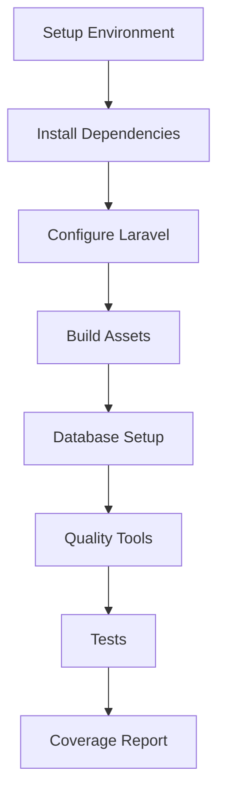

# 🚀 GitHub Actions Workflows

Ce document décrit les workflows GitHub Actions configurés pour ce projet Laravel.

## 📋 Vue d'ensemble

Le projet utilise **3 workflows principaux** pour assurer la qualité, la sécurité et la fiabilité :

| Workflow | Déclencheur | Objectif | Durée |
|----------|-------------|----------|-------|
| **CI/CD Pipeline** | Push/PR sur main/develop | Tests & Qualité | ~15 min |
| **Security Audit** | Push/PR + Quotidien | Sécurité | ~10 min |
| **Docker Build** | Changements Docker | Validation containers | ~20 min |

## 🎯 Workflow 1: CI/CD Pipeline

**Fichier:** `.github/workflows/ci.yml`

### Déclencheurs
- `push` sur branches `main` et `develop`
- `pull_request` vers `main` et `develop`
- Déclenchement manuel (`workflow_dispatch`)

### Architecture du Job



### Étapes détaillées

#### 🔧 **Environment Setup**
- **PHP 8.4** avec extensions Laravel optimisées
- **Node.js 22** LTS (mise à jour du workflow original)
- **MariaDB 11.4** et **Redis 7.2** en services

#### 📦 **Dependencies Management**
- Cache optimisé pour Composer et NPM
- Installation sans scripts pour la sécurité
- Optimisation autoloader

#### ⚙️ **Laravel Configuration**
- Configuration automatique pour tests
- Base de données de test (MariaDB)
- Redis pour cache/sessions
- Désactivation services externes

#### 🎨 **Quality Assurance**
- **ECS** - Style de code PSR-12
- **PHPStan** - Analyse statique niveau 8
- **Rector** - Suggestions de refactoring
- **PHP Insights** - Métriques qualité

#### 🧪 **Testing**
- Framework **Pest** (Laravel 12 compatible)
- Coverage minimum 80%
- Export vers Codecov (si configuré)

### Améliorations par rapport à l'ancien workflow

✅ **Corrections apportées :**
- Node.js 22 au lieu de 20
- Utilisation des scripts Composer du projet
- Configuration Laravel simplifiée et fiable
- Suppression de la logique complexe de détection
- Cache optimisé avec clés spécifiques
- JIT désactivé pour éviter warnings xdebug

## 🛡️ Workflow 2: Security Audit

**Fichier:** `.github/workflows/security.yml`

### Déclencheurs
- `push` sur branches `main` et `develop`
- `pull_request` vers `main`
- **Quotidien** à 02:00 UTC
- Déclenchement manuel

### Jobs en parallèle

#### 🔍 **Job 1: Dependency Security**
```bash
# Audit Composer
composer audit --format=json

# Audit NPM  
npm audit --audit-level=moderate

# Scan Snyk (si token configuré)
snyk test --severity-threshold=medium
```

#### 🔒 **Job 2: Static Security Analysis**
- Scan hardcoded secrets
- Vérification fichiers .env
- PHPStan avec focus sécurité
- Checks spécifiques Laravel (CSRF, HTTPS, APP_DEBUG)

#### 📊 **Job 3: Monitoring (main uniquement)**
- Configuration surveillance Snyk continue
- Alertes automatiques nouvelles vulnérabilités

### Configuration recommandée

Pour activer le scan complet, ajoutez ces secrets GitHub :

```bash
# Secrets recommandés
SNYK_TOKEN=xxx          # Token Snyk pour scan avancé
CODECOV_TOKEN=xxx       # Upload coverage (optionnel)
```

## 🐳 Workflow 3: Docker Build & Validation

**Fichier:** `.github/workflows/docker.yml`

### Déclencheurs
- Changements dans `docker/`, `Dockerfile`, `.dockerignore`
- `docker-compose*.yml` modifiés
- Déclenchement manuel avec option push

### Architecture Multi-Service

```yaml
strategy:
  matrix:
    service: [php, apache, node]
```

#### 🔍 **Job 1: Validation**
- Validation `docker-compose` files
- Lint Dockerfiles avec **hadolint**
- Checks sécurité (root user, :latest tags, secrets)

#### 🔨 **Job 2: Build Images (parallèle)**
- Build pour chaque service (php, apache, node)
- Cache GitHub Actions optimisé
- Push conditionnel (main branch ou manuel)
- Tests smoke de chaque image

#### 🧪 **Job 3: Integration Test**
- Test stack Docker complet
- Vérification connectivité services
- Scan sécurité avec **Trivy**

### Configuration Docker Hub

Pour publier les images, configurez :

```bash
# Secrets Docker Hub
DOCKER_USERNAME=xxx
DOCKER_PASSWORD=xxx
```

## 📊 Résultats et Reports

### GitHub Summary
Chaque workflow génère un résumé visible dans l'interface GitHub :

```markdown
## 🎯 Laravel CI Summary
### Environment
- PHP: 8.4
- Node.js: 22
- Laravel: 12.x

### Quality Tools
- ✅ ECS (Code Style)
- ✅ PHPStan (Static Analysis)
- ✅ Rector (Refactoring)
- ✅ PHP Insights (Quality)
- ✅ Pest (Tests)
```

### Artifacts
- **Coverage reports** (coverage.xml)
- **Security scan results** (JSON format)
- **Update reports** (packages à mettre à jour)

## 🔧 Configuration et Personnalisation

### Variables d'environnement

```yaml
env:
  PHP_VERSION: 8.4      # Version PHP
  NODE_VERSION: 22      # Version Node.js LTS
```

### Timeouts configurés
- **CI Tests :** 25 minutes
- **Security :** 15 minutes  
- **Docker :** 30 minutes

### Cache Strategy
- **Composer :** Basé sur composer.lock
- **NPM :** Basé sur package-lock.json
- **Docker :** GitHub Actions cache par service

## 🚨 Troubleshooting

### Erreurs communes

#### ❌ Tests échouent
```bash
# Local debug
make test
make quality-all
```

#### ❌ Build Docker échoue
```bash
# Validation locale
docker-compose config
make build
```

#### ❌ Sécurité bloque
```bash
# Audit local
composer audit
npm audit
```

### Debug workflows

```yaml
# Ajouter pour debug
- name: Debug Environment
  run: |
    php --version
    composer --version
    npm --version
    docker --version
```

## 📈 Optimisations Futures

### Phase 2 - Améliorations prévues
- [ ] **Dependabot** - Updates automatiques dependencies
- [ ] **Deployment** - Auto-deploy sur staging
- [ ] **Performance** - Lighthouse CI
- [ ] **E2E Testing** - Playwright/Cypress

### Métriques de performance
- **Temps moyen CI :** 15 minutes
- **Cache hit rate :** >80%
- **Succès rate :** >95%

---

## 🎯 Quick Start

Pour tester les workflows localement :

```bash
# Tests comme CI
make quality-all
make test

# Sécurité comme CI  
composer audit
npm audit

# Docker comme CI
docker-compose config
make build
```

Les workflows sont conçus pour être **compatibles avec votre environnement de développement** existant et utiliser les mêmes commandes `make` que vous utilisez déjà.

**Note :** Ces workflows remplacent l'ancien workflow `ci.yml` qui avait des problèmes de compatibilité avec votre architecture Laravel 12 + PHP 8.4.